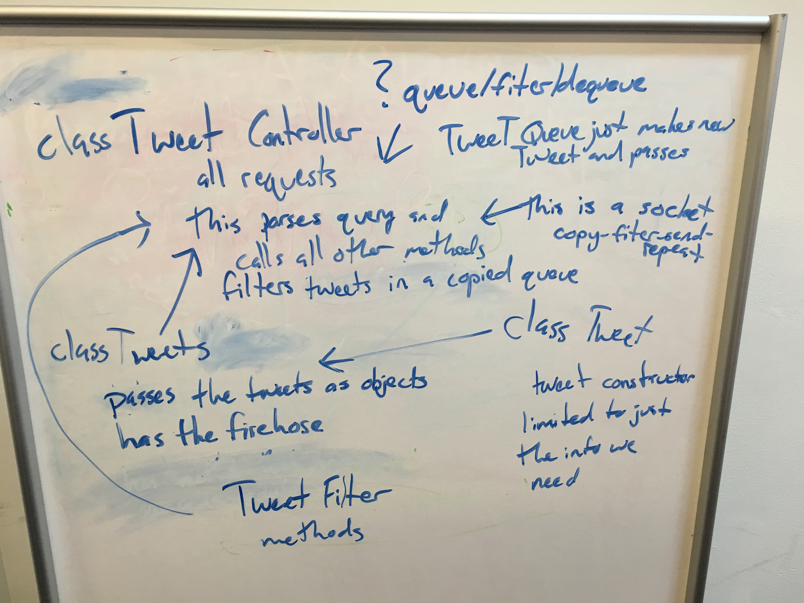

# Fitter - Twitter Filtering API in Java
Created by [David Sudia](https://github.com/dsudia), [Ben Hernandez](https://github.com/benaychh) and [Kyle Maxwell](https://github.com/KyleJayMaxwell).

For an example of a product using this API, look at [this demo client](https://github.com/BenAychh/react-twitter-client).

## Uses and Users
Fitter is a standalone API. It can be used to filter tweets in a variety of ways and send those filtered tweets on to a front-end client. Its users are people who want to build a client that can present these filtered tweets to end-users.

## Technologies Involved
Fitter is built in Java using the Spring IO platform. Specifically, it uses Spring Data to access a Mongo database, Spring Framework to handle route mapping, Spring Session to manage connections, and Spring Framework to provide an MVC for the front-end. The front-end uses React to update the view. It also uses Twitter's HoseBird Client to access Twitter's 1% public firehose of tweets. The project uses JUnit for unit testing and Travis for continuous integration. 

## Features
Fitter filters tweets by geolocation, keyword (both in the body and hash tags) and/or semantic analysis depending on query parameters sent in a GET request. It opens up a websocket and continues to steam tweets matching the selected filters until the connection is closed by the client. Users can sign up for a key so they can build a client that accesses the API.

## Project Tracking
[Pivotal Tracker](https://www.pivotaltracker.com/n/projects/1572541)

## Images
#### Pseudo-coding the project structure

